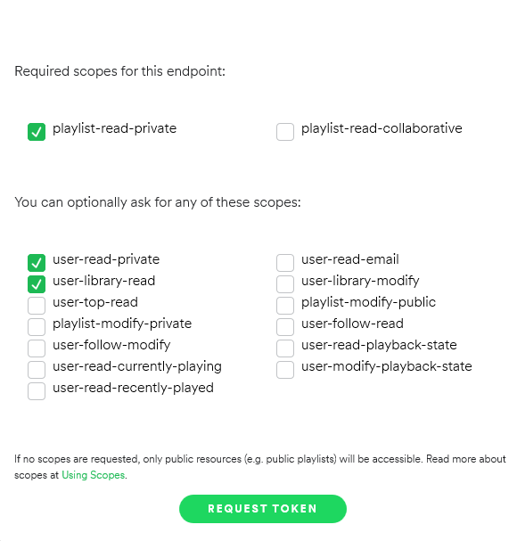
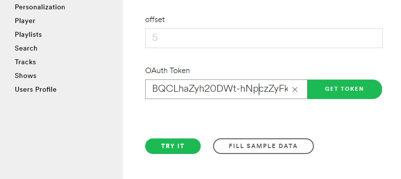

# Youtubify
A Python Script to extract all the playlist from user's spotify id, and create the same selected playlist in Youtube.


## Tools used

- [Request Library](https://realpython.com/python-requests/)

- [Spotify API](https://developer.spotify.com/)

- [Youtube Data API v3](https://developers.google.com/youtube/v3)

## Installing

  - Clone the repo
  
  ``` html
  
  git clone https://github.com/nischal170/Youtubify/
  
  ```
  - Install all the dependencies
  ``` html
pip install -r requirements.txt
```
- Copy Your Spotify User ID and Oauth Token From Spotfiy and paste it to  credentials.py 

    - [Get your Spotify username](https://www.spotify.com/us/account/overview/)
    
    - [Get Your Oauth Spotify token](https://developer.spotify.com/console/get-playlists/)
      
      - Click **Get Token** Button
      
      - Select Scopes and press **Request Token**
      
      
      
      - Copy the token 
      
      
      
- Copy Your **client_id** and **client_secret** to **CLIENT_SECRET_FILE.json** file

  - Get **client_id** and **client_secret** 

     - [Watch the video here](https://youtube.com/)
     
     
## How to use
  Run ```Youtubify.py``` and follow the instructions 
  
  You'll be asked to authenticate,authenticate and provide the authentication token.
  
  
  
  ## Note
   - The spotify token expires every one hour,so if you find out any error including **['items']** this is because of the expiration of spotify token.
   
   - If you have too many tracks in spotify playlist the per day quota for the api request may exceed,this is the main problem for playlist having large number of tracks.
  
  
     
     
     
     
     

     
  
  
      
      
    
    
